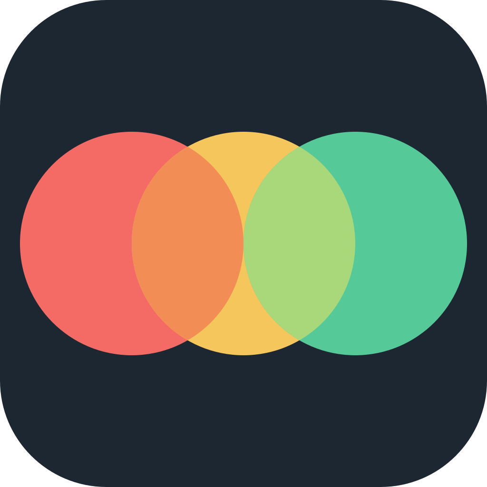
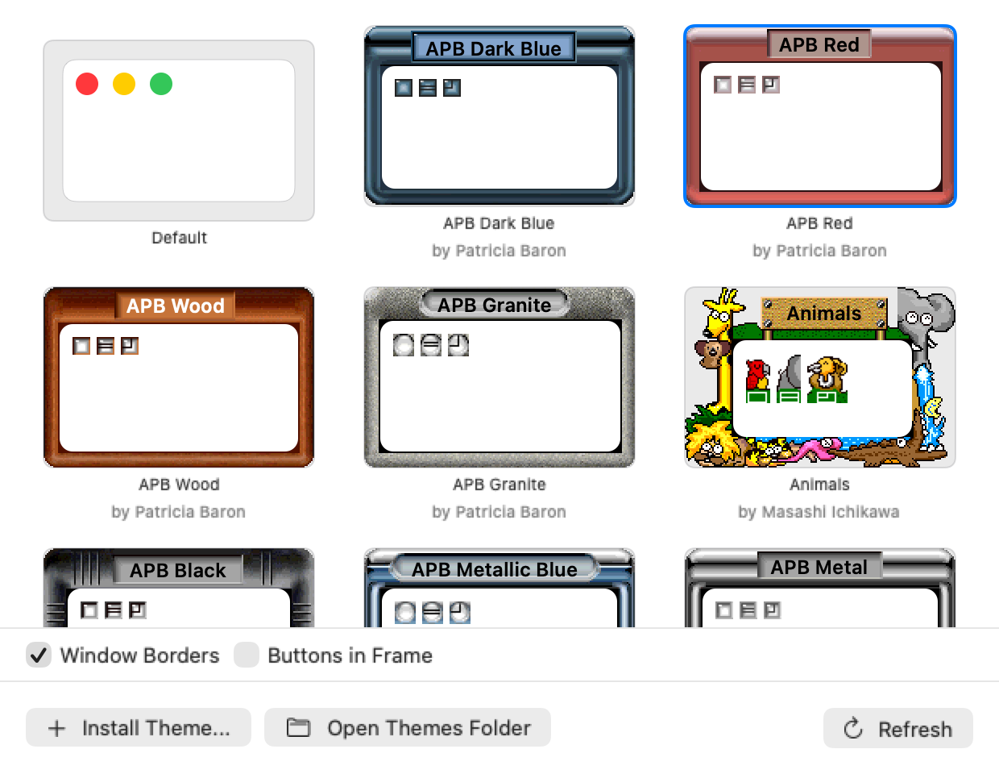
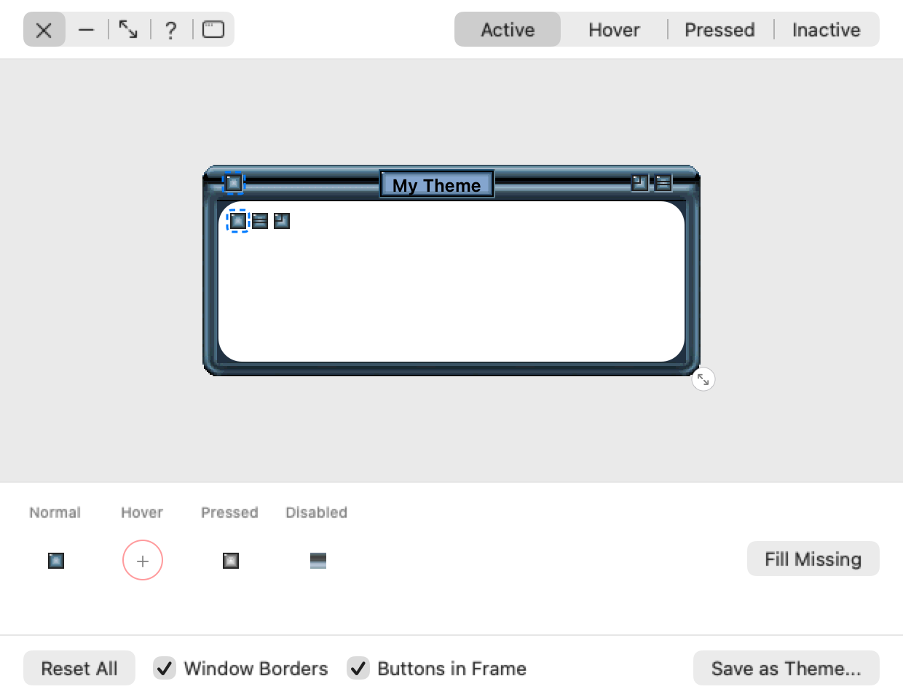

# Trois

Trois brings back the window themes of classic desktop customizers and keeps them working on a modern Mac.

**Features:**

- **Themed buttons** replace close, minimize and zoom
- **Window frames** draw each theme's chrome around your windows
- **One-click install** from the [theme gallery](https://trois-dev.github.io/trois-themes/)
- **Custom tab** to build your own theme or mix parts from others

<p align="center">
  
  
</p>

Made by [sryo](https://github.com/sryo). Not affiliated with the original tools or their authors. See [Credits](#credits).

## Modes

| Mode | Requirements | Description |
|------|--------------|-------------|
| **Overlay** | Accessibility permission | Default mode. Uses overlay windows. |
| **Injection** | SIP disabled | Hooks into apps directly. Seamless. |

## Enabling Injection Mode

Injection mode requires disabling library validation. This is the same approach used by [MacForge](https://github.com/MacEnhance/MacForge).

### Step 1: Disable Library Validation

Open Terminal and run:
```bash
sudo defaults write /Library/Preferences/com.apple.security.libraryvalidation.plist DisableLibraryValidation -bool true
```

### Step 2: Partially Disable SIP

1. **Enter Recovery Mode**
   - Apple Silicon: Hold power button until "Loading startup options" → Options → Continue
   - Intel: Hold ⌘+R during boot

2. **Open Terminal** (Utilities → Terminal) and run:
   ```bash
   csrutil enable --without debug --without fs
   ```

3. **Reboot**. Trois will detect injection mode automatically.

### Re-enabling Security

To restore default security settings:
1. Boot to Recovery Mode
2. Run `csrutil enable`
3. Reboot
4. Run `sudo defaults delete /Library/Preferences/com.apple.security.libraryvalidation.plist DisableLibraryValidation`

## Getting Themes

Trois ships without themes. Get them from the catalog:

- In Trois: Settings > Get Themes, then Install.
- On the web: the gallery at https://trois-dev.github.io/trois-themes/. Install opens Trois, which downloads the theme and applies it.

The catalog lives in [trois-dev/trois-themes](https://github.com/trois-dev/trois-themes). Trois only installs themes listed there and verifies each download before installing it.

You can also drop a theme zip or folder onto Settings > Themes, or use Install Theme. Installed themes go in `~/Library/Application Support/Trois/Themes/`.

## Creating Themes

A theme is a folder of button images (BMP, PNG, JPEG, GIF or TIFF) with a `theme.json` that says which image is which button:

```json
{
  "name": "My Theme",
  "author": "Your Name",
  "version": 1,
  "engine": "EppieDesktop",
  "source": "https://example.com/where-it-came-from",
  "buttons": {
    "close": "close_up.png",
    "closeDown": "close_down.png",
    "minimize": "min_up.png",
    "minimizeDown": "min_down.png",
    "zoom": "max_up.png",
    "zoomDown": "max_down.png",
    "restore": "restore_up.png",
    "restoreDown": "restore_down.png"
  }
}
```

Button keys: `close`, `closeDown`, `closeDisabled`, `minimize`, `minimizeDown`, `minimizeDisabled`, `zoom`, `zoomDown`, `zoomDisabled`, `restore`, `restoreDown`, `help`, `helpDown`. Restore images show on the Zoom button while a window is zoomed or full screen.

`engine` and `source` are optional. `engine` names the tool the theme was made for and shows under the theme's name; leave it out for themes made for Trois. `source` links to the original download or gallery.

Without `theme.json`, Trois guesses from file names such as `close_up`, `close_down`, `min_up`, `max_up`, `restore_up` and `help_up` (underscores or spaces). To share a theme, add it to the catalog repo with a pull request.

### Window Borders

A theme can also draw a frame around each window (overlay mode). Add a `frame/` folder. Its `layout.json` says which engine's rules draw it.

Kaleidoscope 2.x, from the scheme's document window:

| File | Contents |
|------|----------|
| `active.png` | Window chrome for the focused window |
| `inactive.png` | Chrome for other windows (optional) |
| `pressed.png` | Pressed close, zoom and collapse boxes, left to right (optional) |
| `layout.json` | Where the window, buttons and title sit in the images, and which edges stretch |

The window sits in the content rect; everything around it draws outside the window, one point per image pixel.

Kaleidoscope 1.x, drawn by Kaleidoscope's fixed 1.x rules:

| File | Contents |
|------|----------|
| `active.png` | 16x16 miniature window for the focused window |
| `inactive.png` | Miniature window for other windows (optional) |
| `stripes.png` | Title bar racing stripes (optional) |
| `stripes_pattern.png` | Pattern behind the stripes (optional) |
| `layout.json` | `{"format": "k1"}` |

1.x frames use the theme's own `close`, `min` and `max` button images as the title bar boxes. The frame's close, zoom and collapse boxes press the window's close, zoom and minimize buttons, and dragging the frame moves the window. Turn borders off in Settings > Themes.

## Supported Engines

| Engine | Buttons | Frame |
|--------|---------|-------|
| EppieDesktop | Yes | No |
| Kaleidoscope 2.x | Yes | Yes |
| Kaleidoscope 1.x | Yes | Yes |

Want to add another? See [CONTRIBUTING](CONTRIBUTING.md#adding-a-theme-engine).

## Credits

Each theme is the work of the author named in its `theme.json`. They were collected from:

- The [Virtual Plastic Eppie gallery](https://www.virtualplastic.net/html/eppie.html)
- The kaleidoscope.net scheme archive, recovered from the [Internet Archive](https://web.archive.org/)

The themes were made for EppieDesktop (Jeff Epstein) and Kaleidoscope (Arlo Rose and Greg Landweber). Trois reads their files with its own code and is not affiliated with either.

If you made a theme and want it credited differently or removed, [open an issue](https://github.com/trois-dev/trois-themes/issues).

Injection mode uses the same approach as [MacForge](https://github.com/MacEnhance/MacForge).

## License

MIT. See [LICENSE](LICENSE). Themes are the work of their authors and are not covered by it.
